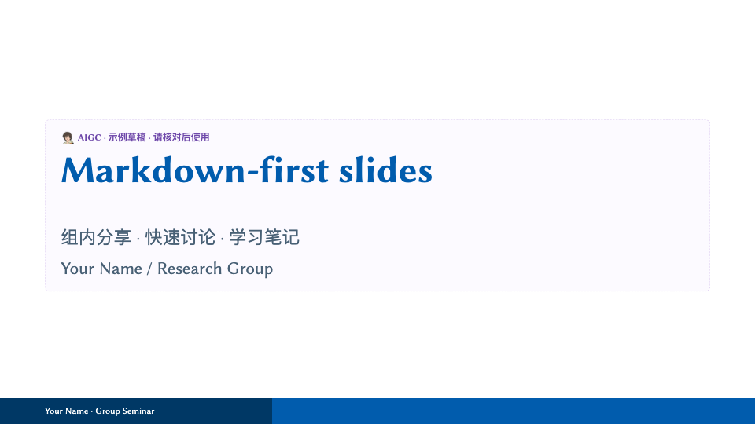

# Slides Templates

两套原生模板：正式报告用 LaTeX/Beamer，轻量分享用 Marp。不要求 Markdown 转 Beamer，也不强求同源。

| LaTeX · 正式报告 | Marp · 轻量分享 |
| --- | --- |
| [](latex/README.md) | [](marp/README.md) |
| 答辩、会议、复杂公式与引用 | 组内分享、课程片段、论文讨论 |
| `main.tex` → Tectonic → PDF | `slides.md` + CSS → Marp → HTML/PDF |
| [使用说明](latex/README.md) | [写作与主题](marp/README.md) |

## 只克隆这个仓库，如何运行？

先准备 Python 3.10+、Make、Node.js 18+、Bun；字体及各功能的可选依赖见[安装清单](docs/setup.md#需要什么)。在一个新的专用目录中：

```bash
mkdir slides
cd slides
git clone https://github.com/virgiling/Slides-Template.git template
python3 template/.agents/skills/init-slides-os/scripts/init_workspace.py --check
python3 template/.agents/skills/init-slides-os/scripts/init_workspace.py
make install
make build-template TYPE=marp
make serve
# 人工打开打印的 Preview: URL
```

**不需要另一个私有工具仓库。** 初始化资源随本仓库提供，生成外层 `slides/` 的 Makefile、共享 engine、预览工具、测试与 Zed 任务；可完整渲染本仓库的 AIGC/callout 示例，而不只是基础 CSS。依赖仍只安装在外层，不进入模板或每份讲稿。

初始化不安装软件、不移动仓库、不启动服务、不改全局配置。已有相同文件跳过，不同文件报冲突，绝不自动覆盖。完整流程、已有克隆的处理及升级方式见[安装与日常操作](docs/setup.md)。

> 这些文件必须已包含在所克隆的版本中；尚未发布的本地改动不会随远端 clone 自动取得。

## 新建自己的报告

在初始化后的外层 `slides/` 执行：

```bash
make new NAME=group-sharing TYPE=marp
# 编辑 group-sharing/slides.md
make serve SLIDE=group-sharing
make build SLIDE=group-sharing              # HTML + assets 位于该报告 build/
make build SLIDE=group-sharing FORMAT=pdf

make new NAME=conference-talk TYPE=latex
# 编辑 conference-talk/main.tex
make build SLIDE=conference-talk            # 需要 Tectonic 和系统字体
```

新报告是独立源码副本，不自动跟随模板更新。分享 Marp HTML 时带上整个 `build/`，不要只复制 HTML。

只用 LaTeX 时也可跳过工作区初始化和所有 Node/Bun 工具：

```bash
cd template/latex                         # 从上面的 slides/ 起步
mkdir -p build
tectonic -X compile example.tex --outdir build --keep-logs --keep-intermediates --synctex
```

## 使用文档与 AI skills

- [安装与日常操作](docs/setup.md)：依赖、初始化、创建/构建/预览、Zed、更新。
- [字体与样式](docs/customization.md)：幻灯片字体、数学字体、终端字体、颜色与图标。
- [本地终端预览](docs/terminal.md)：全屏、Ghostty 共享、会话保活与常见问题。
- [init-slides-os](.agents/skills/init-slides-os/SKILL.md)：为新机器/新克隆初始化工作区。
- [make-marp-slides](.agents/skills/make-marp-slides/SKILL.md)：只将指定讲义片段制作成 Marp 页面片段，不生成封面/结束页，不适用于 Beamer。

Skill 使用 `.agents/skills/<name>/SKILL.md`；支持相应发现规则的 Agent 可按需加载。初始化会给外层工作区安装轻量入口，完整技能仍维护在本仓库。AI 先读 [AGENT.md](AGENT.md) 及对应模板规则；操作指南与技能都不替代用户授权。

## 仓库边界与许可证

`latex/` 和 `marp/` 保持纯模板；`docs/` 是人和 AI 共用的操作指南；`.agents/skills/init-slides-os/assets/` 只保存可审查的初始化资源，不保存 node_modules、字体、个人报告、会话或构建产物。运行时脚本与依赖生成在父工作区。维护工具后按[更新流程](docs/setup.md#更新与验证)同步资源。

封面 PNG 来自真实编译；重建使用外层 `make thumbnails [TYPE=latex|marp]`。代码许可证见 [LICENSE.txt](LICENSE.txt)；Marp 的 AIGC logo 属第三方，不适用 MIT，分发前确认权限或替换，见 [Marp 说明](marp/README.md#素材版权)。
