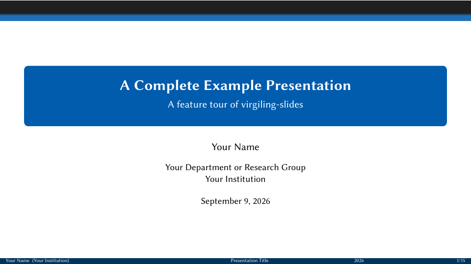

# LaTeX · virgiling-slides

[← 模板选择](../README.md) · [Marp 轻量模板](../marp/README.md) · [安装与初始化](../docs/setup.md) · [修改字体](../docs/customization.md)



*来自 `example.tex` 实际编译 PDF 的第一页。更新封面后，在外层 `slides/` 运行 `make thumbnails TYPE=latex`；或编译后执行 `pdftoppm -f 1 -singlefile -png -scale-to-x 960 -scale-to-y 540 build/example.pdf thumbnail`。需要 Tectonic 与 Poppler（`pdftoppm`）。*

`virgiling-slides` 是一个面向学术报告的 Beamer 文档类，提供清晰的顶部进度导航、统一的三栏页脚、蓝色结构层级、稳定的页面留白，以及适合公式和代码展示的字体配置。

## 功能

- 16:9 默认示例，并兼容标准 Beamer 类选项；
- 黑色低饱和色带、section 名称和带间距的 frame 进度圆点组成的顶部导航；
- 不显示 subsection 标题的独立强调色带；
- 标题页、总目录和分节目录命令；
- 方形无序列表和带数字的方形有序列表；
- block、columns、overlay、handout、speaker notes 和 appendix；
- Cambria Math 数学字体；
- MD IO 代码字体与 `listings` 语法高亮；
- BibLaTeX 紧凑作者年份引用；
- 以 `VirgilingBlue`（`#015CAD`）和 `VirgilingCyan`（`#003865`）组成的蓝青层级；
- 使用略深 `VirgilingCyan`、带安全边距且可覆盖内容的同色三栏页脚。

## 环境要求

- Tectonic
- Linux Biolinum：Regular、Bold、Italic
- Cambria Math
- MD IO：Regular、Bold、Italic、Bold Italic
- Skim（可选，仅人工预览），用于 Zed 编译后的 PDF 定位与刷新

Linux Biolinum、Cambria Math 和 MD IO 均直接从系统字体库加载，不需要复制字体、下载字体或运行初始化脚本。Linux Biolinum 没有独立 Bold Italic 时，模板只对系统 Bold 字体合成斜体形态。

Tectonic 读取系统字体时可能输出：

```text
accessing absolute path ... build may not be reproducible
```

这表示构建依赖本机字体，不是字体缺失错误。

## 文件结构

```text
template/latex/
├── .zed/tasks.json       # Zed 编译任务
├── AGENT.md              # 模板维护约束
├── README.md             # 使用说明
├── example.tex           # 完整功能示例
├── references.bib        # 示例参考文献库
├── virgiling-slides.cls  # Beamer 文档类
└── build/                # 编译产物，不纳入版本控制
```

忽略规则统一位于模板仓库根目录的 `../.gitignore`，许可证位于 `../LICENSE.txt`；子模板不维护各自的 `.gitignore`。

## 新建报告

需要统一 Make/Zed 命令时，先按[初始化指南](../docs/setup.md)从本仓库生成外层 `slides/` 工作区；只编译 LaTeX 可跳过初始化，直接使用下方 Tectonic 命令，不需要 Node/Bun。工作区中运行 `make new NAME=my-talk TYPE=latex`（默认类型也是 `latex`）。新报告独立维护 `main.tex`，不会自动跟随模板更新。单独使用此仓库时，只复制 `example.tex`（改名为 `main.tex`）、`virgiling-slides.cls`、`references.bib` 及根目录的 `.gitignore`、`LICENSE.txt`。

AI 使用前应依次阅读 `../AGENT.md` 和本目录 `AGENT.md`。默认只做编译和 CLI/API 检查，不调用浏览器工具或视觉模型；外观问题由人反馈。


## Zed

单独用 Zed 打开 `latex/` 目录，可执行 `LaTeX: Tectonic + Skim` 任务。若打开的是外层 `slides/` 工作区，则使用根级 `Slides: Build Current` 或 `Slides: Build + Preview Current`。人工选择预览任务时会：

1. 创建 `build/`；
2. 编译当前 `.tex` 文件；
3. 把 PDF、SyncTeX、日志和辅助文件写入 `build/`；
4. 使用 Skim 打开或刷新对应 PDF，并跳转到当前源码行。

任务等价于：

```bash
mkdir -p build
tectonic -X compile example.tex \
  --outdir build \
  --keep-logs \
  --keep-intermediates \
  --synctex
```

生成的示例位于 `build/example.pdf`。

## 基本用法

```latex
\documentclass[10pt,aspectratio=169]{virgiling-slides}

\title[Short Title]{Full Presentation Title}
\subtitle{Optional Subtitle}
\author[Your Name]{Your Name}
\institute[Institution]{Department or Research Group\\Institution}
% Date and footer year default to the compilation date.

\begin{document}

\VirgilingTitleFrame
\VirgilingOutlineFrame

\section{Introduction}
\subsection{Motivation}

\begin{frame}{Motivation}
  Your content.
\end{frame}

\end{document}
```

经典 4:3 比例：

```latex
\documentclass[10pt]{virgiling-slides}
```

打印版：

```latex
\documentclass[10pt,aspectratio=169,handout]{virgiling-slides}
```

## 模板命令

### 标题页

```latex
\VirgilingTitleFrame
```

标题页保留顶部色带和页脚，但不显示 section 名称或进度圆点。

### 日期

默认无需填写 `\date`：标题页显示编译当天的日期，页脚显示当前年份。类文件内置的设置是：

```latex
\date[\the\year]{\today}
```

`\today` 使用 LaTeX 的日期格式，默认英文示例为 `September 7, 2026`；`\the\year` 输出年份。日期在重新编译时更新，打开已有 PDF 不会更新。

如需固定报告日期，仍可在导言区覆盖默认值：

```latex
\date[2026]{05 Sept. 2026}
```

使用 `\date{}` 可隐藏标题页和页脚的日期。

### 总目录

```latex
\VirgilingOutlineFrame
\VirgilingOutlineFrame[Presentation Overview]
```

### 分节目录

在导言区启用：

```latex
\VirgilingEnableSectionOutlines
\VirgilingEnableSectionOutlines[Section Overview]
```

启用后，每个 section 开始时会自动插入当前分节目录。

### 页脚

方括号中的短元数据会自动用于页脚：

```latex
\title[Short Title]{Full Presentation Title}
\author[Your Name]{Your Name}
\institute[Institution]{Full Institution Name}
\date[Event 2026]{Event or Seminar Name\\Month 2026}
```

也可以分别覆盖：

```latex
\renewcommand{\VirgilingFooterLeft}{Your Name (Institution)}
\renewcommand{\VirgilingFooterCenter}{Short Presentation Title}
\renewcommand{\VirgilingFooterRight}{Event 2026\hfill\insertframenumber/\inserttotalframenumber}
```

## 代码高亮

模板内置 `listings` 并默认启用 `virgiling` 样式。它直接由 TeX 排版，不需要 shell escape、Python 或 Pygments。代码 frame 需要使用 `fragile` 选项：

```latex
\begin{frame}[fragile]{Code}
\begin{lstlisting}[language=Python,numbers=left]
def normalize(values):
    if not values:
        raise ValueError("empty input")
    total = sum(values)
    return [value / total for value in values]
\end{lstlisting}
\end{frame}
```

行内代码仍可使用 `\texttt{...}`；需要行内语法环境时可使用 `\lstinline|...|`。`language`、`numbers`、`caption` 等均为标准 `listings` 选项。

## 引用

示例使用 BibLaTeX 的 `alphabetic` 样式和 `sorting=none`。引用标签由作者姓氏缩写和两位年份组成，例如单作者 `[Lam94]`；作者较多时显示前三位作者的姓氏首字母并添加 `+`，例如 `[VSP+17]`。参考文献按首次引用顺序排列。

```latex
\usepackage[
  backend=bibtex,
  style=alphabetic,
  sorting=none,
  maxalphanames=3,
  minalphanames=3,
  maxbibnames=3,
  minbibnames=3,
  doi=false,
  isbn=false,
  url=false,
  eprint=false
]{biblatex}
\addbibresource{references.bib}
\DeclareFieldFormat[inproceedings]{booktitle}{%
  \textcolor{black!55}{\mkbibemph{#1}}%
}
```

正文和参考文献页分别使用：

```latex
Typesetting conventions~\cite{lamport1994latex}.
Multi-author work~\cite{vaswani2017attention}.

\begin{frame}{References}
  \printbibliography[heading=none]
\end{frame}
```

示例选择 `backend=bibtex`，因此现有 Tectonic 与 Zed 任务无需额外安装 Biber。参考文献库需要使用 BibTeX 可处理的字符写法；如果需要 Unicode 文献数据或 BibLaTeX 的高级排序功能，可安装 Biber 后将后端改为 `backend=biber`。

## 示例内容

`example.tex` 是可直接编译的功能索引，包含列表、分栏、三种 block、数学公式、定义、定理、证明、表格、TikZ 图、外部图片写法、语法高亮代码、overlay、脚注、紧凑作者年份引用、内部跳转、结束页和备用页。
