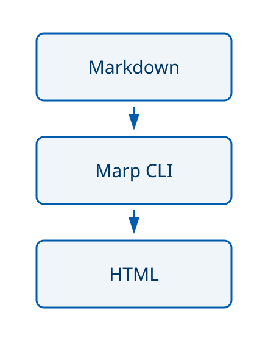

<!-- _class: lead -->
<!-- _paginate: false -->

> [!aigc] 示例草稿 · 请核对后使用
>
> # Markdown-first slides
>
> 组内分享 · 快速讨论 · 学习笔记
>
> Your Name / Research Group

<!-- AIGC: Speaker notes are Markdown comments. Never put secrets here. -->

---

> [!aigc]
>
> # One slide, one message
>
> - 用 Markdown 写内容，用 `---` 分页。
> - **强调结论**，把补充说明放进演讲备注。
> - AI 生成的标题、正文和代码，都放在 AIGC 框里。
>
> > [!note] 选对工具
> > 轻量分享用 Marp；正式报告使用旁边的 LaTeX 模板。

---

> [!aigc] 代码示例
>
> # Code is content
>
> ```python
> def summarize(values):
>     # Reject empty input explicitly.
>     if not values:
>         raise ValueError("empty input")
>     return sum(values) / len(values)
> ```
>
> MD IO 等宽字体 · 原生语法高亮 · 右上角语言标签

---

> [!aigc] 公式示例
>
> # Mathematics
>
> 用 `$...$` 写行内公式：$x_{k+1} = T(x_k)$。
>
> $$
> \hat{\theta} = \arg\min_\theta
> \sum_{i=1}^{n} \left(y_i - f_\theta(x_i)\right)^2
> $$
>
> KaTeX → 原生 MathML → 本机 Cambria Math。
>
> 不替换 KaTeX HTML 的内部字体，也不分发字体文件。

---

> [!aigc] Obsidian-flavored callouts
>
> # Make the intent visible
>
> > [!note] 事实与背景
> > 使用 `> [!note] 标题`，正文继续以 `>` 开头。
>
> > [!tip] 实践建议
> > 支持自定义标题、嵌套、列表、公式和代码块。
>
> > [!warning] 边界与风险
> > `[!type]+` / `[!type]-` 在幻灯片中始终展开，避免导出遗漏。

---

> [!aigc] 模板使用建议
>
> # Choose the right track
>
> | | LaTeX | Marp |
> | --- | --- | --- |
> | 场合 | 答辩 / 正式报告 | 学习分享 / 讨论 |
> | 输入 | `main.tex` | `slides.md` |
> | 默认输出 | PDF | HTML |
> | 构建工具 | Tectonic | Marp CLI |
>
> 两套模板各自原生写作，不强求同一份源文件。

---

<!-- _class: image-split -->

> [!aigc] 图片示例
>
> # Images stay with the talk
>
> 左栏解释，右栏放图；两栏都保留在 AIGC 框内。
>
> 图片使用相对路径：
>
> `assets/workflow.svg`
>
> 

---

> [!aigc] 演示操作
>
> # Navigate without the mouse
>
> `j/l` 下一步，`h/k` 上一步；`gg/G` 跳到首尾页。
>
> * 第一步：这是同一页里的一个 fragment。
> * 第二步：逐步显示，不增加右下角的页码。
>
> `*` 列表逐条显示，`-` 列表一次显示。
>
> 到达片段边界后，继续前后导航会切换到相邻页。

---

<!-- _class: lead -->

> [!aigc]
>
> # Questions?
>
> 改 Markdown → HTTP 实时预览 → 人工确认外观
>
> [Marp 文档](https://marp.app/) · [Obsidian Callouts](https://help.obsidian.md/callouts)
